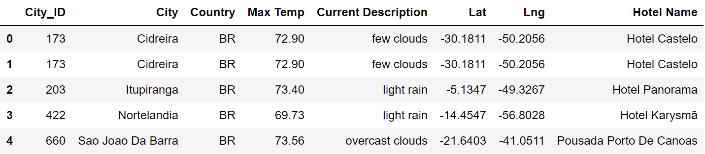
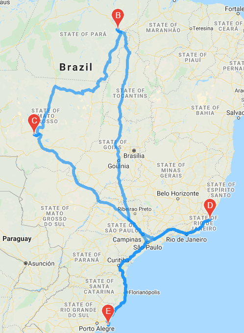
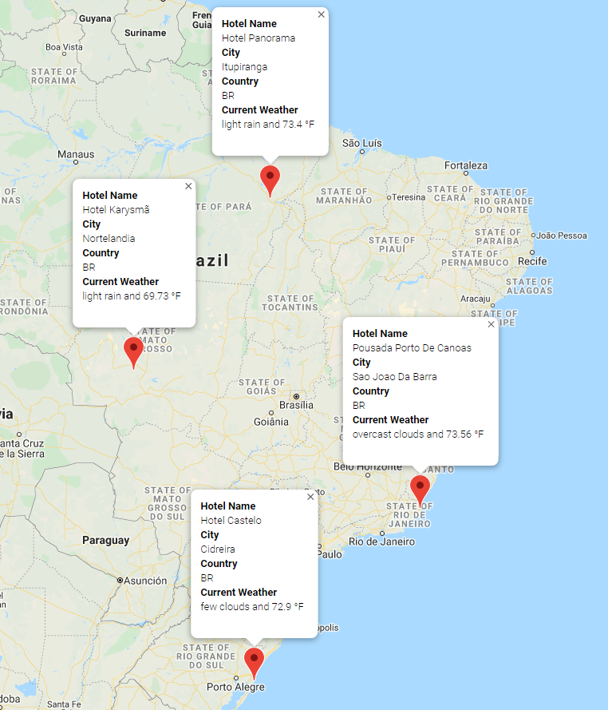
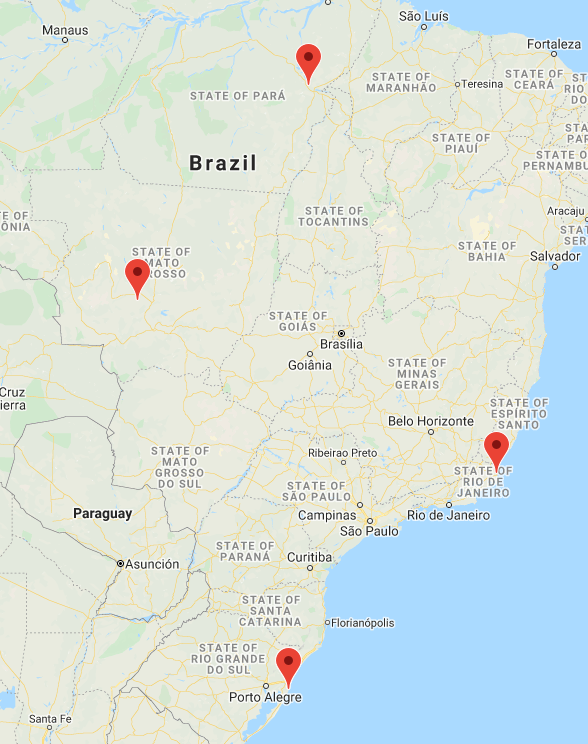

# World Weather Analysis

## Overview of Project:

We will be using Python, google maps API and pandas to perform analysis on various locations globally. We will be looking at their weather, ranging their temperatures and weather conditions for vacation purposes. 

### Purpose:

The purpose of this project is to utilize Python, Pandas and the GMAP API to find a range of minimum and maximum temperatures across the globe. We want to identify a range of temperatures that we like and where in the world we can go that fits the criteria. We use API, city geo locations to find hotels near those coordinates. 

## Analysis Results and Challenges:

### Analysis of Outcomes 
To get a general base for this project, we will be setting up 2000 randomly generated coordinates. We then will find what are the closest locations to these geolocation points. This comes back with 566 cities.

Based on the locations, we compiled a list based on temperatures ranging from 70-90°F.

#### Vacation Map

From the vacation map, Brazil seemed like a fine location for a vacation.  In Brazil, four cities where chosen to visit.  we used Google Maps to pick a driving route, map with pop-up markers for additional information, which includes hotel information, and map designating the four cities (with no additional pop-ups) were generated.

#### Mauritius Travel Itinerary

#### Mauritius Vacation Driving Route

    

#### Mauritius Vacation Map with Pop-up Markers

#### Mauritius Vacation Map without Pop-up Markers

### Challenges and Difficulties Encountered
Many issues I had encountered were primarily dealing with the API functionality and displaying the graphs/maps.
